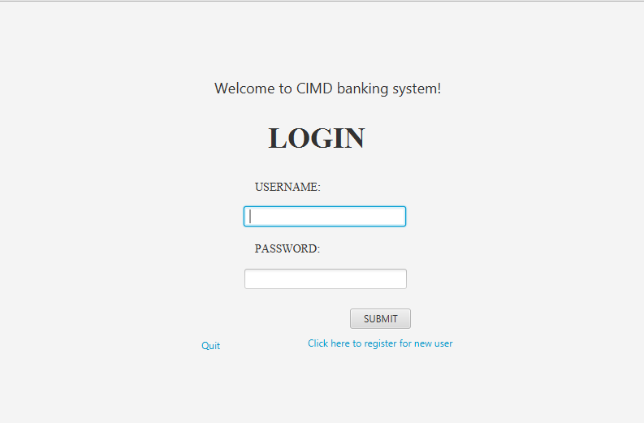
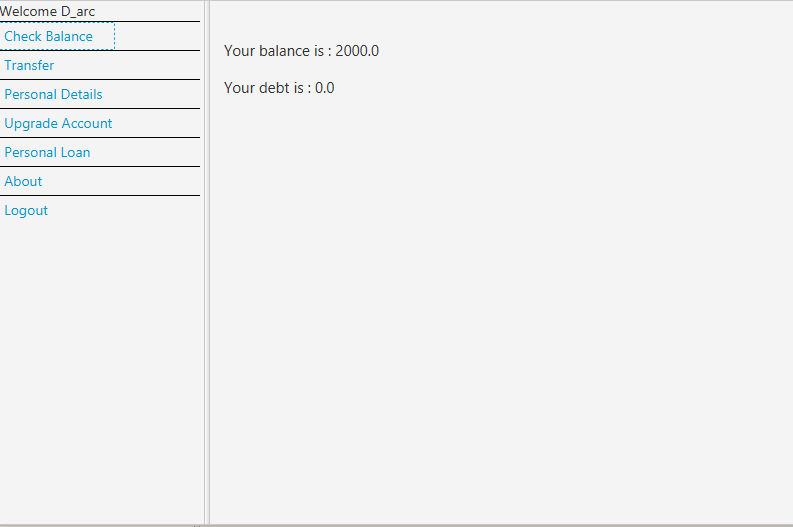
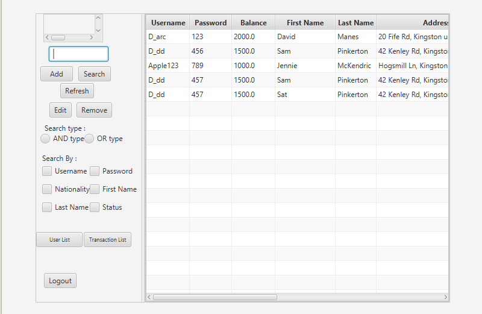
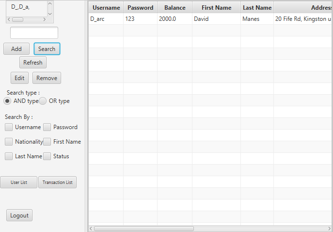
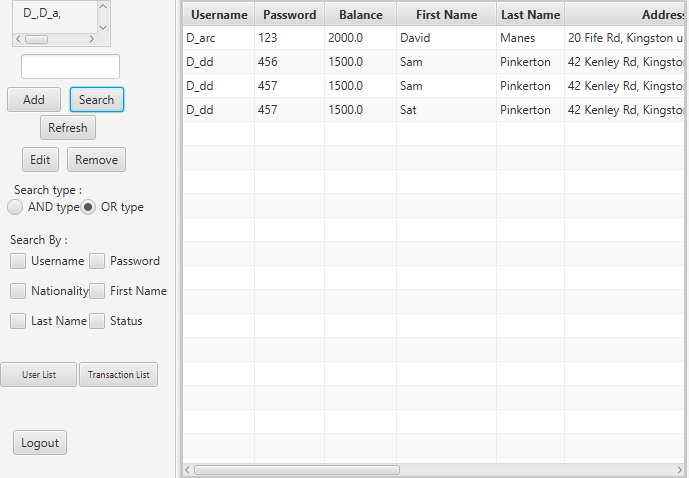
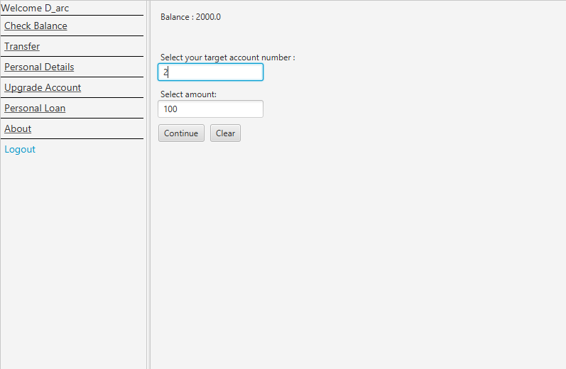
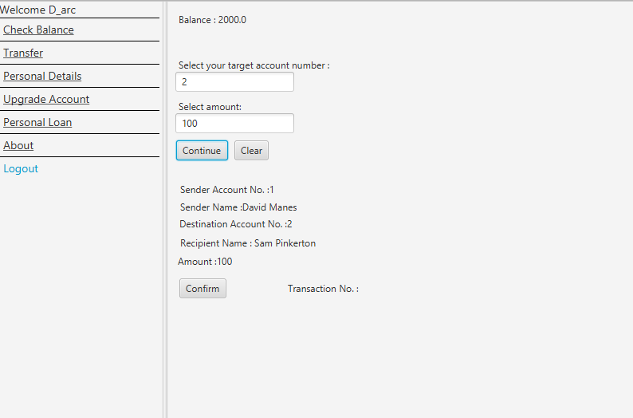
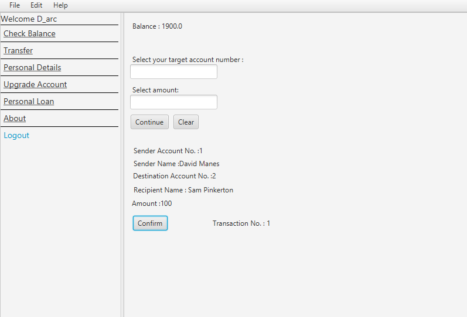
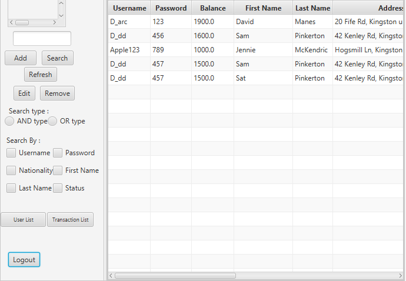

A banking system prototype implemented using Scala langauge and use of ScalaFX and ScalaFXML libraries with paradise plugin.
The system provides 2 types of interface, for user and for admins.
 

 <b>Main screen : </b>
 

 

 <b>User Interface : &emsp;&emsp;&emsp;&emsp;&emsp;&emsp;&emsp;&emsp;&emsp;&emsp;&emsp;&emsp;&emsp;&emsp;&emsp;&emsp;&emsp;&emsp;&emsp; Admin Interface</b>

 
 
  

 
 
 
 
 
 

<b>ADMIN INTERFACE</b>

 
 Admin interface can be accessed by inputting "admin" as the username and password into the login screen, and it has the capability to edit user information,and to perform searches of information supporting multiple queries.
 Admin can also filter out to decide what categories of user information to search (Username, location, etc).
 Search mechanism implemented in this project is composed of 2 types, and both type of searches can predict the result from substring.
 First type of search (search AND) will show the result when all user queries are true.
 
 
 <b>Result of Search AND : </b> 
 

 The image above is the result of inputting queries "D_" and "D_a". Since the type of search used is an AND search, the search yields
 only "D_arc" since it both fits the both user-inputted queries for search type AND.
 
  
 <b>Result of Search OR : </b> 
 

 The image above represents the result of using search OR mechanism. Based on the same previous queries ("D_" and "D_a"), the search mechanism 
 picked any username with "D_" OR "D_a". In this case, the list yields 4 users with username "D_" and filter out existing user with username "Apple123".
 Admin is also able to view transaction history as well in the forms of table.
 
 
 
 
 
 
<b>USER INTERFACE</b>

 User is allowed to view his/her balance,transfer fee, edit existing details, and upgrade the account so he/she can make a loan.
 The following example illustrates the flow of user transaction :
 
 <b>Transaction Interface : &emsp;&emsp;&emsp;&emsp;&emsp;&emsp;&emsp;&emsp;&emsp;&emsp;&emsp;&emsp;&emsp;&emsp;&emsp;&emsp;&emsp;&emsp;&emsp;Transaction Interface (asking for confirmation)  </b>

 
 
   
 

 
  
 <b>Transaction Done :  &emsp;&emsp;&emsp;&emsp;&emsp;&emsp;&emsp;&emsp;&emsp;&emsp;&emsp;&emsp;&emsp;&emsp;&emsp;&emsp;&emsp;&emsp;&emsp; Admin Interface updated :</b>

 
 
   	
 

